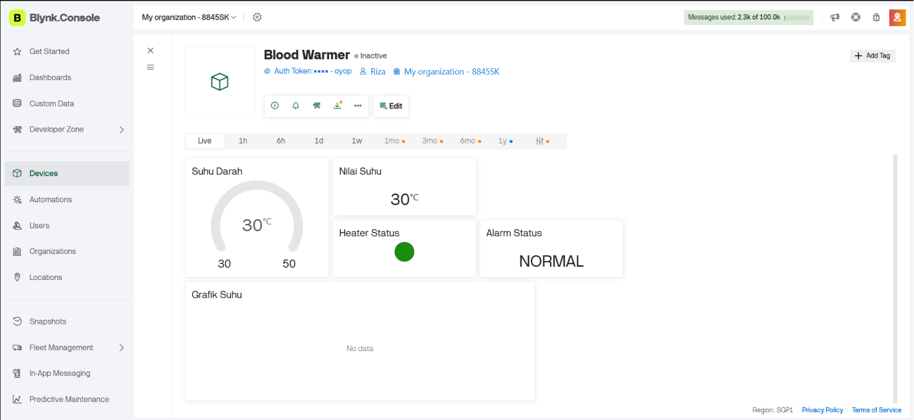
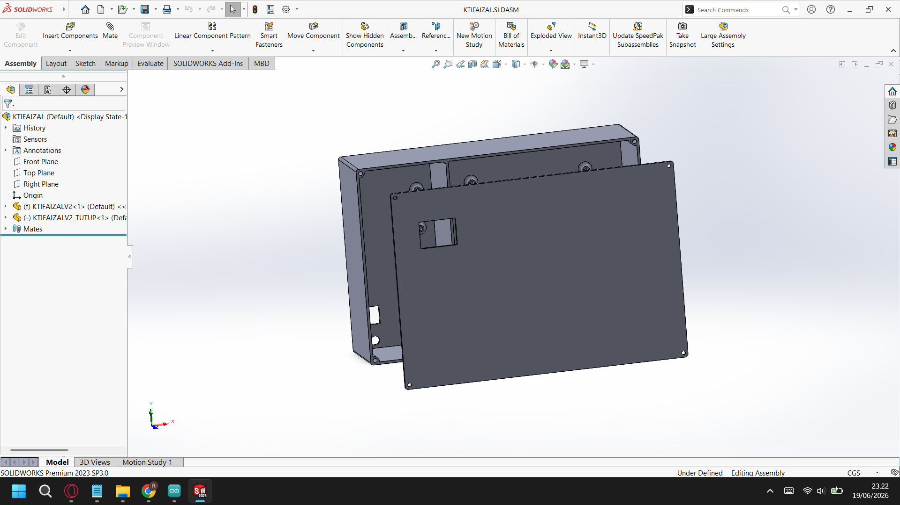

# Blood Warmer IoT

## Overview

Blood Warmer IoT is a portable temperature monitoring and heating system designed to maintain blood temperature within a safe range during transfusion procedures. The system uses an ESP32 microcontroller, DS18B20 temperature sensors, a nichrome wire heater, OLED display, and Blynk cloud integration for real-time monitoring.

This project demonstrates the integration of embedded systems, sensor acquisition, temperature control, and IoT technology in a biomedical engineering application.

---

## Features

- Real-time temperature monitoring
- Dual DS18B20 temperature sensors
- PWM-based heater control
- OLED SSD1306 temperature display
- Blynk cloud monitoring
- Over-temperature alarm using buzzer
- Portable embedded system architecture
- WiFi connectivity for remote monitoring

---

## Hardware Components

| Component | Quantity |
|------------|----------|
| ESP32 DevKit V1 | 1 |
| DS18B20 Temperature Sensor | 2 |
| IRLZ44N MOSFET | 1 |
| Nichrome Wire Heater | 1 |
| OLED SSD1306 (0.96") | 1 |
| Active Buzzer | 1 |
| 12V Power Supply | 1 |
| Resistors and Wiring | Several |

---

## System Architecture

---

## Pin Configuration

| Device | ESP32 Pin |
|----------|-----------|
| DS18B20 | GPIO15 |
| Heater MOSFET | GPIO13 |
| Buzzer | GPIO26 |
| OLED SDA | GPIO21 |
| OLED SCL | GPIO22 |

---

## Working Principle

1. The DS18B20 sensors continuously measure temperature.
2. Temperature data is processed by the ESP32.
3. If the temperature falls below the target range, the heater is activated through a MOSFET driver using PWM control.
4. If the temperature exceeds the safety threshold, an alarm is triggered through the buzzer.
5. Temperature information is displayed on the OLED screen.
6. Monitoring data is transmitted to the Blynk cloud platform via WiFi.

---

## Blynk Dashboard

## Enclosure

